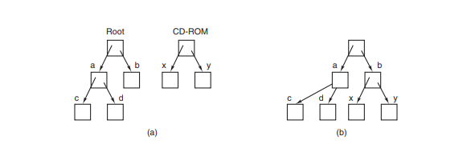
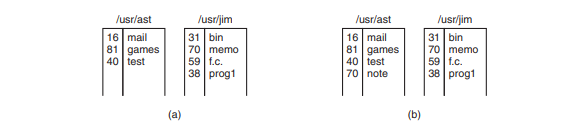
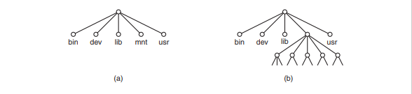

Komponen Sistem Operasi
Terdapat tiga elemen dasar yangmembangun   perancangan   sistem operasi secara umum. Komponen- komponen ini dapat disebut modular karena memiliki fungsi yang berbeda dan  dapat dikembangkan  secara terpisah. Ketiga bagian tersebut antara lain:

1. User Interface.
2. Kernel.
3. sistem manajemen file.

Pada kenyataannya tidak semua sistem operasi mempunyai struktur yang sama. Namun menurut Avi Silberschatz, Peter Galvin, dan Greg Gagne, umumnya sebuah sistem operasi modern mempunyai komponen sebagai berikut:

1. Managemen Proses.
2. Managemen Memori Utama.
3. Managemen Secondary-Storage.
4. Managemen Sistem I/O.
5. Managemen Berkas.
6. Sistem Proteksi.
7. Jaringan.
8. Command-Interpreter system.

Dara pembagian diatas bisa saya jelaskan lebih lanjut melalui keterangan dibawah ini;

 

 &nbsp &nbsp &nbsp Proses adalah keadaan ketika sebuah program sedang di eksekusi. Sebuah proses membutuhkan beberapa sumber daya untuk menyelesaikan tugasnya. sumber daya tersebut dapat berupa CPU time, memori, berkas-berkas, dan perangkat-perangkat I/O.
Sistem operasi bertanggung jawab atas aktivitas-aktivitas yang berkaitan dengan managemen proses seperti:

### 1. Pembuatan dan penghapusan proses pengguna dan sistem proses.

menghapus program yang sedang berjalan di laptop pada sistem operasi linux

masuk ke menu pencarian lalu tuliskan system monitor kemudian pilih  

maka akan muncul tampilan ini di sini kita bisa melihat program apa saja yg sedang berjalan di  laptop kita untuk menghapus proses silahkan pilih program yg ingin di hapus lalu klik end task  

### 2. Menunda atau melanjutkan proses.
contoh menunda dan melanjutkan proses download pada linux

pada tampilan terlihat saya sedang mendownload klik kanan pada mouse lalu pilih  pause maka proses mendownload akan di tunda   

dan jika ingin melanjutkan proses download maka klik kanan pada mouse lagi  lalu pilih resume untuk melanjutkan proses downloadan tadi  

### 3. Menyediakan mekanisme untuk proses sinkronisasi.
contoh proses sinkronisasi pada whatsapp yang ada di android dengan di laptop melalui whatsapp web di linux.

pertama buka mozila firefox  

lalu klik kan di pencarian whatsapp web  

lalu singkronisasikan whatsapp yang ada di handphone dengan yang ada di laptop   menggunkan QR CODE maka whatsappmu akan tersinkron dengan yang ada pada laptop  

 

 &nbsp &nbsp &nbsp Memori utama atau lebih dikenal sebagai memori adalah sebuah array yang besar dari word atau byte, yang ukurannya mencapai ratusan, ribuan, atau bahkan jutaan. Setiap word atau byte mempunyai alamat tersendiri. Memori Utama berfungsi sebagai tempat penyimpanan yang akses datanya digunakan oleh CPU atau perangkat I/O. Memori utama termasuk tempat penyimpanan data yang sementara (volatile), artinya data dapat hilang begitu sistem dimatikan.

Sistem operasi bertanggung jawab atas aktivitas-aktivitas yang berkaitan dengan managemen memori seperti:

1. Menjaga track dari memori yang sedang digunakan dan siapa yang
menggunakannya.
2. Memilih program yang akan di-load ke memori.
3. Mengalokasikan dan meng-dealokasikan ruang memori sesuai kebutuhan.

### contoh untuk melihat penggunaan memori di terminal linux.

  

### info memory di terminal linux.

  

### untuk melihat penggunaan memori di cmd windows.

  

  

 

 &nbsp &nbsp &nbsp Data yang disimpan dalam memori utama bersifat sementara dan jumlahnya sangat kecil. Oleh karena itu, untuk meyimpan keseluruhan data dan program computer dibutuhkan secondary-storage yang bersifat permanen dan mampu menampung banyak data. Contoh dari secondary-storage adalah harddisk, disket, dll.

Sistem operasi bertanggung-jawab atas aktivitas-aktivitas yang berkaitan dengan disk-management seperti: 
1. Manajemen ruang kosog
2. alokasi penyimpanan.
3. penjadualan disk.

### Contoh untuk melihat penggunaan penyimpanan kosong di task manager.

  

melihat volume disk  

 

 &nbsp &nbsp &nbsp Sering disebut device manager. Menyediakan “device driver” yang umum sehingga operasi I/O dapat seragam (membuka, membaca, menulis, menutup). Contoh: pengguna menggunakan operasi yang sama untuk membaca berkas pada hard-disk, CD-ROM dan floppy disk.
Komponen Sistem Operasi untuk sistem I/O:

1. Buffer: menampung sementara data dari/ ke perangkat I/O.
2. Spooling: melakukan penjadualan pemakaian I/O sistem supaya lebih efisien (antrian dsb.).
3. Menyediakan driver untuk dapat melakukan operasi “rinci” untuk perangkat keras I/O tertentu.

contoh input memprint file pdf   

 

 &nbsp &nbsp &nbsp Berkas adalah kumpulan informasi yang berhubungan sesuai dengan tujuan pembuat berkas tersebut. Berkas dapat mempunyai struktur yang bersifat hirarkis (direktori, volume, dll.). Sistem operasi bertanggung-jawab:

### 1. Contoh pembuatan dan penghapusan berkas di linux.

masuk kedalam terminal lalu tuliskan <b>touch nama_file.jinis_file</b> lalu enter  

maka file baru dengan nama yang kamu ingin buat tadi akan muncul jika ingin  menghapus berkas atau file silahkan tekan tombol delete paa keyboard  

### 2. Contoh pembuatan dan penghapusan direktori di linux.

klik tombol activities di pjok kiri atas  

pilih menu file  

kemudian disini saya ingin menambah direktori ke dalam folder document   

kemudian klik kanan pada mouse atau touch pad lalu pilih new folder  

masukkan nama direktori baru  

maka anda telah berhasil membuat sebuah directori baru jika ingin  menghapusnya silahkan tekan delete pada keyboard  

### 3. contoh manipulasi berkas dan direktori di linux.

pilih folder yang ingin di edit klik kanan pilih rename untuk mengganti  atau memanipulasi nama folder tersebut  

 

Proteksi mengacu pada mekanisme untuk mengontrol akses yang dilakukan oleh program, prosesor, atau pengguna ke sistem sumber daya. Mekanisme proteksi harus:

### 1. membedakan antara penggunaan yang sudah diberi izin dan yang belum.

sistem operasi akan meminta autenthication ketika ingin mengubah setting untuk unlock printer  

contoh lain sistem operasi akan meminta password ketika ingin menginstall aplikasi  

 

 &nbsp &nbsp &nbsp Sistem terdistribusi adalah sekumpulan prosesor yang tidak berbagi memori atau clock. Tiap prosesor mempunyai memori sendiri. Prosesor-prosesor tersebut terhubung melalui jaringan komunikasi Sistem terdistribusi menyediakan akses pengguna ke bermacam sumber-daya sistem. Akses tersebut menyebabkan:

### 1. melihat kecepatan jaringan di cmd.

menggunakan perintah 8.8.8.8 -t -l 1500   

### 1. cek aplikasi dan program yang memakan banayak kuota di task manager.

  

 

 &nbsp &nbsp &nbsp Sistem Operasi menunggu instruksi dari pengguna (command driven). Program yang membaca instruksi dan mengartikan control statements umumnya disebut: control-card interpreter, command-line interpreter, dan UNIX shell.
Command-Interpreter System sangat bervariasi dari satu sistem operasi ke system operasi yang lain dan disesuaikan dengan tujuan dan teknologi I/O devices yang ada. Contohnya:

### 1. Terminal Linux 

terminal linux  

### 2.CMD Windows

contoh cmd windows  

 

 
Layanan sistem operasi dirancang untuk membuat pemrograman menjadi lebih mudah.

1. Pembuatan Program: Sistem operasi menyediakan berbagai fasilitas yang membantu programer dalam membuat program seperti editor. Walaupun bukan bagian dari sistem operasi, tapi layanan ini diakses melalui sistem operasi. 

contoh pembuatan program di visual studio code</b>  

2. Eksekusi Program: Sistem harus bisa me-load program ke memori, dan menjalankan program tersebut. Program harus bisa menghentikan pengeksekusiannya baik secara normal maupun tidak (ada error).

menjalankan program tanpa eror</b> lalu enter  

3. Deteksi Error. Sistem operasi harus selalu waspada terhadap kemungkinan error. Error dapat terjadi di CPU dan memori perangkat keras, Masukan/Keluaran, dan di dalam program yang dijalankan pengguna. Untuk setiap jenis error sistem operasi harus bisa mengambil langkah yang tepat untuk mempertahankan jalannya proses komputasi. Misalnya dengan menghentikan jalannya program, mencoba kembali melakukan operasi yang dijalankan, atau melaporkan kesalahan yang terjadi agar pengguna dapat mengambil langkah selanjutnya.

mendeteksi eror karena salah menuliskan code program phyton</b> lalu enter  

 

<li align="justify">Alokasi Sumber Daya. Ketika beberapa pengguna menggunakan sistem atau beberapa program dijalankan secara bersamaan, sumber daya harus dialokasikan bagi masing-masing pengguna dan program tersebut. 

<li align="justify">Accounting. Kita menginginkan agar jumlah pengguna yang menggunakan sumber daya, dan jenis sumber daya yang digunakan selalu terjaga. Untuk itu maka diperlukan suatu perhitungan dan statistik. Perhitungan ini diperlukan bagi seseorang yang ingin merubah konfigurasi sistem untuk meningkatkan pelayanan. 

<li align="justify">Proteksi. Layanan proteksi memastikan bahwa segala akses ke sumber daya terkontrol. Dan tentu saja keamanan terhadap gangguan dari luar sistem tersebut. Keamanan bisa saja dilakukan dengan terlebih dahulu mengidentifikasi pengguna. Ini bisa dilakukan dengan meminta password bila ingin menggunakan sumber daya.

 

System program menyediakan lingkungan yang memungkinkan pengembangan program dan eksekusi berjalan dengan baik. Dapat dikategorikan:

1. Manajemen/manipulasi berkas. Membuat, menghapus, copy, rename, print, memanipulasi berkas dan direktori.
2. Informasi status. Beberapa program meminta informasi tentang tanggal, jam, jumlah memori dan disk yang tersedia, jumlah pengguna dan informasi lain yang sejenis.
3. Modifikasi berkas. Membuat berkas dan memodifikasi isi berkas yang disimpan pada disk atau tape. 
4. Pendukung bahasa pemrograman. Kadang kala kompilator, assembler, interpreter dari bahasa pemrograman diberikan kepada pengguna dengan bantuan sistem operasi. 
5. Loading dan eksekusi program. Ketika program di-assembly atau dikompilasi, program tersebut harus di-load ke dalam memori untuk dieksekusi. Untuk itu sistem harus menyediakan absolute loaders, relocatable loaders, linkage editors, dan overlay loaders. 
6. Komunikasi Menyediakan mekanisme komunikasi antara proses, pengguna, dan sistem komputer yang berbeda. Sehingga pengguna bisa mengirim pesan, browse web pages, mengirim e-mail, atau mentransfer berkas.

<li align="justify">Umumnya sistem operasi dilengkapi oleh system-utilities atau program aplikasi yang di dalamnya termasuk web browser, word prossesor dan format teks, sistem database, games. System program yang paling penting adalah command interpreter yang mengambil dan menerjemahkan user-specified command selanjutnya. 

 

manajemen proses menjalankan aplikasi photoshop dengan cmd di windows  

  

manajemen sistem berkas menambahkan file baru dalam directori  

  

 

