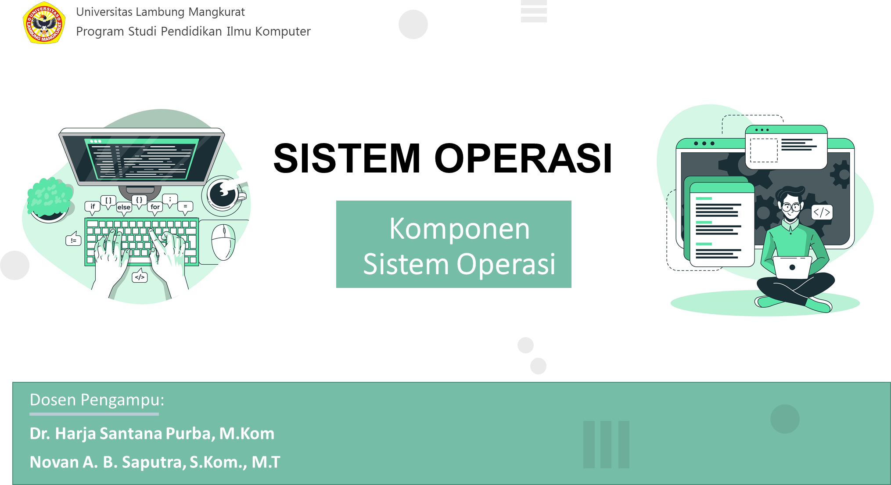

Komponen Sistem Operasi
Terdapat tiga elemen dasar yangmembangun   perancangan   sistem operasi secara umum. Komponen- komponen ini dapat disebut modular karena memiliki fungsi yang berbeda dan  dapat dikembangkan  secara terpisah. Ketiga bagian tersebut antara lain:

1. User Interface.
2. Kernel.
3. sistem manajemen file.

Pada kenyataannya tidak semua sistem operasi mempunyai struktur yang sama. Namun menurut Avi Silberschatz, Peter Galvin, dan Greg Gagne, umumnya sebuah sistem operasi modern mempunyai komponen sebagai berikut:

1. Managemen Proses.
2. Managemen Memori Utama.
3. Managemen Secondary-Storage.
4. Managemen Sistem I/O.
5. Managemen Berkas.
6. Sistem Proteksi.
7. Jaringan.
8. Command-Interpreter system.

Dara pembagian diatas bisa saya jelaskan lebih lanjut melalui keterangan dibawah ini;

 

Proses adalah keadaan ketika sebuah program sedang di eksekusi. Sebuah proses membutuhkan beberapa sumber daya untuk menyelesaikan tugasnya. sumber daya tersebut dapat berupa CPU time, memori, berkas-berkas, dan perangkat-perangkat I/O.
Sistem operasi bertanggung jawab atas aktivitas-aktivitas yang berkaitan dengan managemen proses seperti:

1. Pembuatan dan penghapusan proses pengguna dan sistem proses.
2. Menunda atau melanjutkan proses.
3. Menyediakan mekanisme untuk proses sinkronisasi.
4. Menyediakan mekanisme untuk proses komunikasi.
5. Menyediakan mekanisme untuk penanganan deadlock.

 

Memori utama atau lebih dikenal sebagai memori adalah sebuah array yang besar dari word atau byte, yang ukurannya mencapai ratusan, ribuan, atau bahkan jutaan. Setiap word atau byte mempunyai alamat tersendiri. Memori Utama berfungsi sebagai tempat penyimpanan yang akses datanya digunakan oleh CPU atau perangkat I/O. Memori utama termasuk tempat penyimpanan data yang sementara (volatile), artinya data dapat hilang begitu sistem dimatikan.

Sistem operasi bertanggung jawab atas aktivitas-aktivitas yang berkaitan dengan managemen memori seperti:

1. Menjaga track dari memori yang sedang digunakan dan siapa yang
menggunakannya.
2. Memilih program yang akan di-load ke memori.
3. Mengalokasikan dan meng-dealokasikan ruang memori sesuai kebutuhan.

 

Data yang disimpan dalam memori utama bersifat sementara dan jumlahnya sangat kecil. Oleh karena itu, untuk meyimpan keseluruhan data dan program computer dibutuhkan secondary-storage yang bersifat permanen dan mampu menampung banyak data. Contoh dari secondary-storage adalah harddisk, disket, dll.

Sistem operasi bertanggung-jawab atas aktivitas-aktivitas yang berkaitan dengan disk-management seperti: 
1. Manajemen ruang kosog
2. alokasi penyimpanan.
3. penjadualan disk.

 

Sering disebut device manager. Menyediakan “device driver” yang umum sehingga operasi I/O dapat seragam (membuka, membaca, menulis, menutup). Contoh: pengguna menggunakan operasi yang sama untuk membaca berkas pada hard-disk, CD-ROM dan floppy disk.
Komponen Sistem Operasi untuk sistem I/O:

1. Buffer: menampung sementara data dari/ ke perangkat I/O.
2. Spooling: melakukan penjadualan pemakaian I/O sistem supaya lebih efisien (antrian dsb.).
3. Menyediakan driver untuk dapat melakukan operasi “rinci” untuk perangkat keras I/O tertentu.

 

Berkas adalah kumpulan informasi yang berhubungan sesuai dengan tujuan pembuat berkas tersebut. Berkas dapat mempunyai struktur yang bersifat hirarkis (direktori, volume, dll.). Sistem operasi bertanggung-jawab:

1. Pembuatan dan penghapusan berkas.
2. Pembuatan dan penghapusan direktori.
3. Mendukung manipulasi berkas dan direktori.
4. Memetakan berkas ke secondary storage.
5. Mem-backup berkas ke media penyimpanan yang permanen (non-volatile).

 

Proteksi mengacu pada mekanisme untuk mengontrol akses yang dilakukan oleh program, prosesor, atau pengguna ke sistem sumber daya. Mekanisme proteksi harus:

1. membedakan antara penggunaan yang sudah diberi izin dan yang belum.
2. Spesifikasi kontrol untuk di terima.
3. Menyediakan alat untuk pemberlakuan sistem.

 

Sistem terdistribusi adalah sekumpulan prosesor yang tidak berbagi memori atau clock. Tiap prosesor mempunyai memori sendiri. Prosesor-prosesor tersebut terhubung melalui jaringan komunikasi Sistem terdistribusi menyediakan akses pengguna ke bermacam sumber-daya sistem. Akses tersebut menyebabkan:

1. Peningkatan kecepatan komputasi.
2. Peningkatan penyediaan data.
3. Peningkatan keandalan.

 

Sistem Operasi menunggu instruksi dari pengguna (command driven). Program yang membaca instruksi dan mengartikan control statements umumnya disebut: control-card interpreter, command-line interpreter, dan UNIX shell.
Command-Interpreter System sangat bervariasi dari satu sistem operasi ke system operasi yang lain dan disesuaikan dengan tujuan dan teknologi I/O devices yang ada. Contohnya:

1. CLI, 
2. Windows, 
3. Pen-based (touch), dan lain-lain.

 
 

Layanan sistem operasi dirancang untuk membuat pemrograman menjadi lebih mudah.

1. Pembuatan Program: Sistem operasi menyediakan berbagai fasilitas yang membantu programer dalam membuat program seperti editor. Walaupun bukan bagian dari sistem operasi, tapi layanan ini diakses melalui sistem operasi. 

2. Eksekusi Program: Sistem harus bisa me-load program ke memori, dan menjalankan program tersebut. Program harus bisa menghentikan pengeksekusiannya baik secara normal maupun tidak (ada error). 

3. Operasi Masukan/Keluaran. Program yang sedang dijalankan kadang kala membutuhkan Masukan/Keluaran. Untuk efisiensi dan keamanan, pengguna biasanya tidak bisa mengatur peranti Masukan/Keluaran secara langsung, untuk itulah sistem operasi harus menyediakan mekanisme dalam melakukan operasi Masukan/Keluaran. 

4. Manipulasi Sistem Berkas. Program harus membaca dan menulis berkas, dan kadang kala juga harus membuat dan menghapus berkas. 
Komunikasi. Kadang kala sebuah proses memerlukan informasi dari proses yang lain. Ada dua cara umum dimana komunikasi dapat dilakukan. 

5. Komunikasi dapat terjadi antara proses dalam satu komputer, atau antara proses yang berada dalam komputer yang berbeda, tetapi dihubungkan oleh jaringan komputer. Komunikasi dapat dilakukan dengan share-memory atau message-passing, dimana sejumlah informasi dipindahkan antara proses oleh sistem operasi. 

6. Deteksi Error. Sistem operasi harus selalu waspada terhadap kemungkinan error. Error dapat terjadi di CPU dan memori perangkat keras, Masukan/Keluaran, dan di dalam program yang dijalankan pengguna. Untuk setiap jenis error sistem operasi harus bisa mengambil langkah yang tepat untuk mempertahankan jalannya proses komputasi. Misalnya dengan menghentikan jalannya program, mencoba kembali melakukan operasi yang dijalankan, atau melaporkan kesalahan yang terjadi agar pengguna dapat mengambil langkah selanjutnya.

 &nbsp &nbsp Biasanya tersedia sebagai instruksi bahasa assembly. Beberapa sistem mengizinkan system calls dibuat langsung dari program bahasa tingkat tinggi. Beberapa bahasa pemrograman (contoh: C, C++) telah didefenisikan untuk menggantikan bahasa assembly untuk sistem pemrograman.

 &nbsp &nbsp Tiga metode umum yang digunakan dalam memberikan parameter kepada sistem operasi:  
1. Melalui register.  
2. Menyimpan parameter dalam block atau tabel pada memori dan alamat block tersebut diberikan  sebagai parameter dalam register.  
3. Menyimpan parameter (push) ke dalam stack oleh program, dan melakukan pop off pada stack  oleh sistem operasi. 

<li align="justify">System calls yang berhubungan dengan kontrol proses antara lain ketika penghentian pengeksekusian program. Baik secara normal (end) maupun tidak normal (abort).

<li align="justify">Selama proses dieksekusi kadang kala diperlukan untuk me-load atau mengeksekusi program lain, disini diperlukan lagi suatu system calls. Juga ketika membuat suatu proses baru dan menghentikan sebuah proses. Ada juga system calls yang dipanggil ketika kita ingin meminta dan merubah atribut dari suatu proses.

<li align="justify">MS-DOS adalah contoh dari sistem single-tasking. MS-DOS menggunakan metoda yang sederhana dalam menjalankan program aan tidak menciptakan proses baru. Program di-load ke dalam memori, kemudian program dijalankan. Berkeley Unix adalah contoh dari sistem multi-tasking. Command Interpereter masih tetap bisa dijalankan ketika program lain dieksekusi. 

 

<li align="justify">System Call untuk manajemen proses diperlukan untuk mengatur proses-proses yang sedang berjalan. Kita dapat melihat penggunaan system calls untuk manajemen proses pada Sistem Operasi Unix. Contoh yang paling baik untuk melihat bagaimana system call bekerja untuk manajemen proses adalah Fork. Fork adalah satu satunya cara untuk membuat sebuah proses baru pada sistem Unix. Fork membuat duplikasi yang mirip dengan proses aslinya, termasuk file descriptor, register, dan lainnya.

<li align="justify">Setelah perintah Fork, child akan mengeksekusi kode yang berbeda dengan parentnya. Bayangkan yang terjadi pada shell. Shell akan membaca command dari terminal, melakukan fork pada child, menunggu child untuk mengeksekusi command tersebut, dan membaca command lainnya ketika child terminate. 

<li align="justify">Untuk menunggu child selesai, parent akan mengeksekusi system call waitpid, yang hanya akan menunggu sampai child selesai. Proses child harus mengeksekusi command yang dimasukkan oleh user(pada kasus shell). Proses child melakukannya dengan menggunakan system call exec. 

<li align="justify">Dari ilustrasi tersebut kita dapat mengetahui bagaimana system call dipakai untuk manajemen proses. Kasus lainnya bukan hanya pada Fork, tetapi hampir setiap proses memerlukan system call untuk melakukan manajement proses. 

 

<li align="justify">System calls yang berhubungan dengan berkas sangat diperlukan. Seperti ketika kita ingin membuat atau menghapus suatu berkas. Atau ketika ingin membuka atau menutup suatu berkas yang telah ada, membaca berkas tersebut, dan menulis berkas itu. System calls juga diperlukan ketika kita ingin mengetahui atribut dari suatu berkas atau ketika kita juga ingin merubah atribut tersebut. Yang termasuk atribut berkas adalah nama berkas, jenis berkas, dan lain-lain.

<li align="justify">Ada juga system calls yang menyediakan mekanisme lain yang berhubungan dengan direktori atau sistim berkas secara keseluruhan. Jadi bukan hanya berhubungan dengan satu spesifik berkas. Contohnya membuat atau menghapus suatu direktori, dan lain-lain. 

 

<li align="justify">Program yang sedang dijalankan kadang kala memerlukan tambahan sumber daya. Jika banyak 
 

<li align="justify">pengguna yang menggunakan sistem, maka jika memerlukan tambahan sumber daya maka harus meminta peranti terlebih dahulu. Dan setelah selesai penggunakannnya harus dilepaskan kembali. Ketika sebuah peranti telah diminta dan dialokasikan maka peranti tersebut bisa dibaca, ditulis, atau direposisi.

 

<li align="justify">Beberapa system calls disediakan untuk membantu pertukaran informasi antara pengguna dan sistem operasi. Contohnya system calls untuk meminta dan mengatur waktu dan tanggal. Atau meminta informasi tentang sistem itu sendiri, seperti jumlah pengguna, jumlah memori dan disk yang masih bisa digunakan, dan lain-lain. Ada juga system calls untuk meminta informasi tentang proses yang disimpan oleh sistem dan system calls untuk merubah (reset) informasi tersebut.

<li align="justify">Beberapa system calls disediakan untuk membantu pertukaran informasi antara pengguna dan sistem operasi. Contohnya system calls untuk meminta dan mengatur waktu dan tanggal. Atau meminta informasi tentang sistem itu sendiri, seperti jumlah pengguna, jumlah memori dan disk yang masih bisa digunakan, dan lain-lain. Ada juga system calls untuk meminta informasi tentang proses yang disimpan oleh sistem dan system calls untuk merubah (reset) informasi tersebut.

<li align="justify">Dalam message-passing, sebelum komunikasi dapat dilakukan harus dibangun dulu sebuah koneksi. Untuk itu diperlukan suatu system calls dalam pengaturan koneksi tersebut, baik dalam menghubungkan koneksi tersebut maupun dalam memutuskan koneksi tersebut ketika komunikasi sudah selesai dilakukan. Juga diperlukan suatu system calls untuk membaca dan menulis pesan (message) agar pertukaran informasi dapat dilakukan. 

